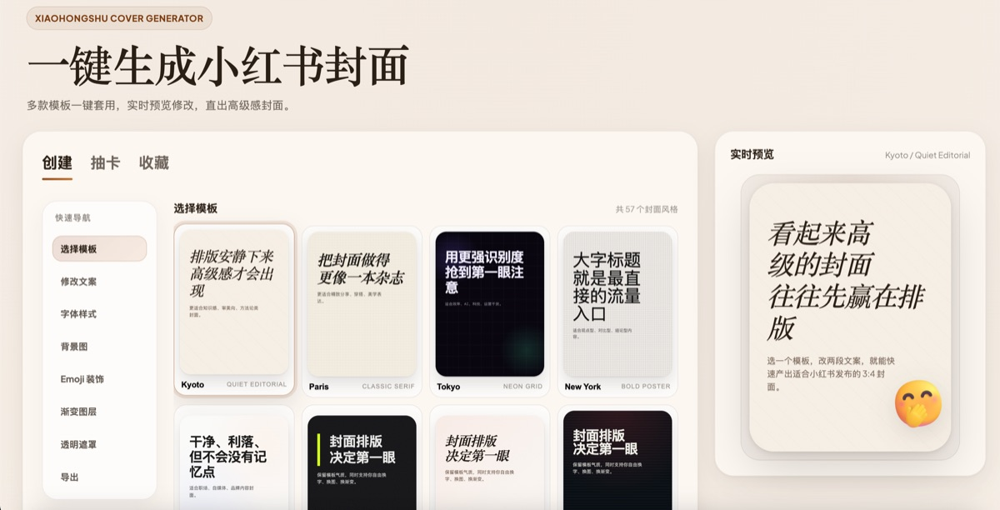
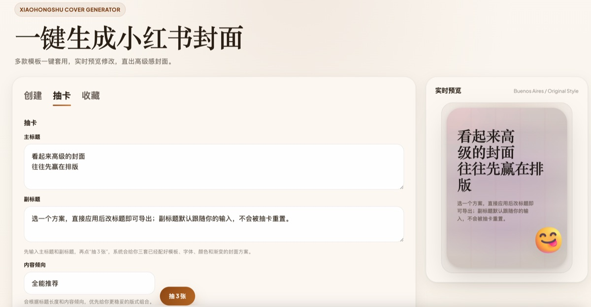
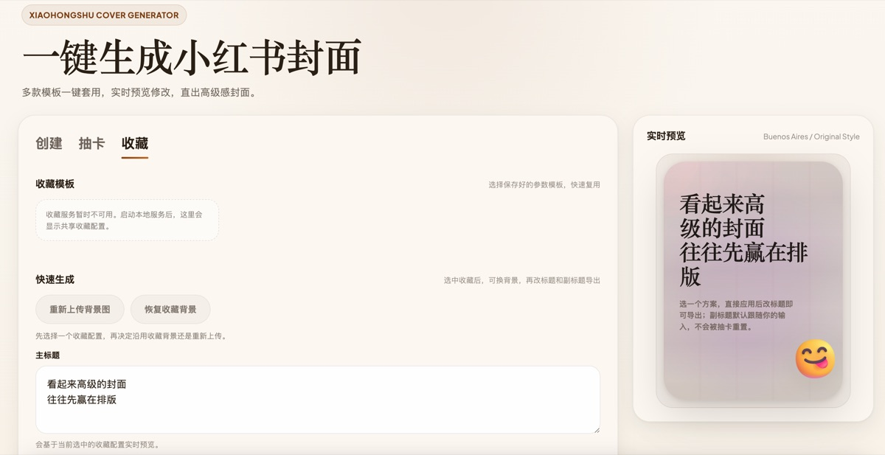

# 小红书封面图生成器

一键生成小红书 3:4 竖版封面图。三种方式：自己调、随机抽、收藏复用。

## 效果示例

| 自行创建 | 抽卡 | 收藏 |
| --- | --- | --- |
|  |  |  |

---

## 方式一：直接使用（不用 AI）

适合所有人，不需要任何技术基础。

### 下载

去 [GitHub Releases](../../releases) 下载最新的压缩包，解压到任意位置。

### 打开

双击解压后的 `index.html`，浏览器会自动打开编辑页面。

### 做封面

- 左边是控制面板，右边是实时预览
- 选模板、改字体、换背景、调颜色
- 满意了点「导出 PNG」下载图片

---

## 方式二：配合 AI 使用（OpenClaw / Claude Code）

如果你使用 AI 编程工具，可以让 AI 直接帮你生成封面图。

### 安装

把本仓库下载或克隆到你的 skills 目录：

**OpenClaw：**
```bash
git clone https://github.com/monsignorlaw1015/xiaohongshu-magazine-cover.git ~/.openclaw/skills/xiaohongshu-cover
```

**Claude Code：**
```bash
git clone https://github.com/monsignorlaw1015/xiaohongshu-magazine-cover.git
# 然后把仓库路径添加到你的 Claude Code agent 配置中
```

### 使用

安装完成后，直接跟 AI 说：

- "帮我生成一张小红书封面图"
- "生成封面图，标题是「5个习惯让你越来越自律」"
- "用抽卡模式出一张封面"

AI 会引导你选择模式：

| 模式 | 说明 |
|------|------|
| **自行创建** | AI 打开浏览器页面，你自己调参数 |
| **抽卡** | 你给个标题，AI 随机出一套封面 |
| **收藏** | 用你之前存好的风格，换文案直接出图 |

生成的图片会直接显示在对话中。

### 前置条件

- **Node.js 18+**（抽卡和收藏模式需要）
- **Google Chrome**（抽卡和收藏模式需要，自行创建模式不需要）

---

## 常见问题

**打开 HTML 后样式不对？** 需要联网加载字体，确认网络正常。

**AI 生成时报错找不到 Chrome？** 需要安装 [Google Chrome](https://www.google.com/chrome/)。

**收藏模式提示没有收藏？** 先用「自行创建」模式在页面上调好参数，保存为收藏后再使用。

---

## 致谢

本项目的设计灵感来源于 [citycraft](https://github.com/oil-oil/citycraft)，感谢作者的开源贡献。

## License

[MIT](LICENSE)
